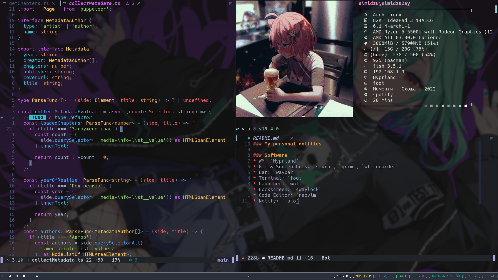
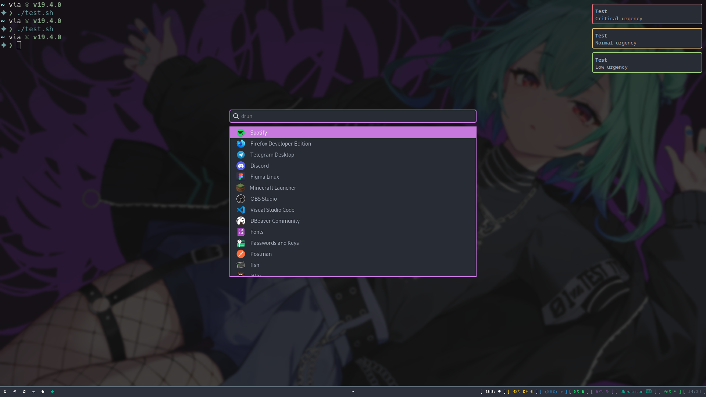

## My personal dotfiles

### Software
* WM: `Hyprland`
* Gif & Screenshots: `slurp`, `grim`, `wf-recorder`
* Bar: `waybar`
* Terminal: `foot`
* Launcher: `wofi`
* Lockscreen: `swaylock`
* Code Editor: `neovim`
* Notify: `mako`

### Screenshots

